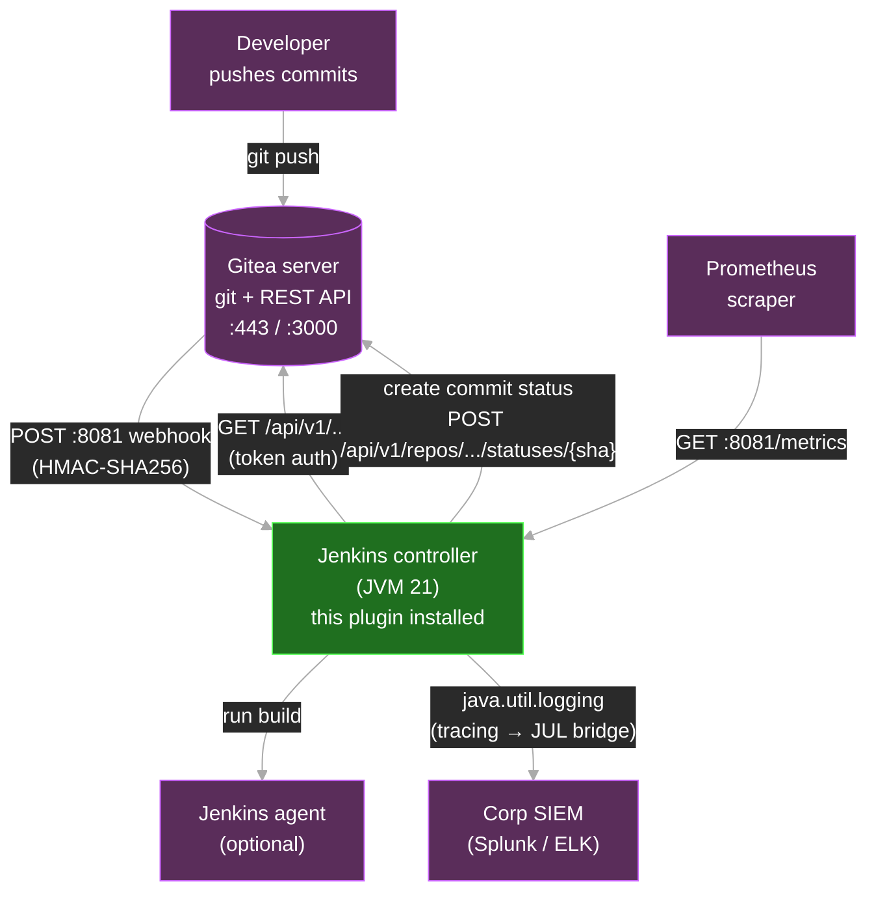
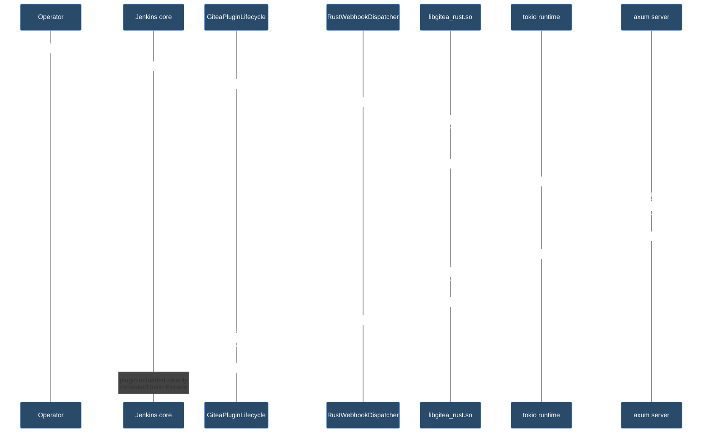
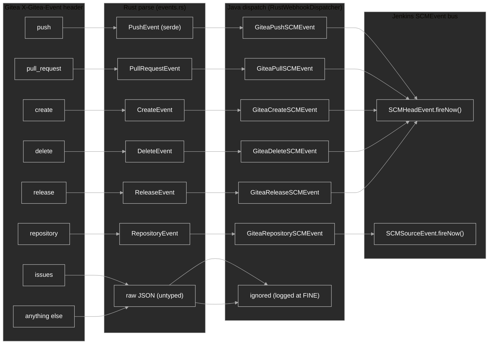
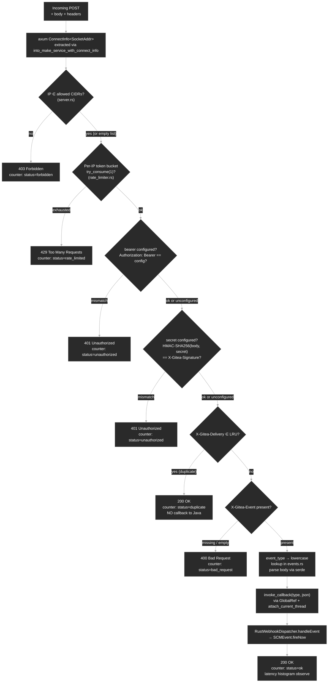
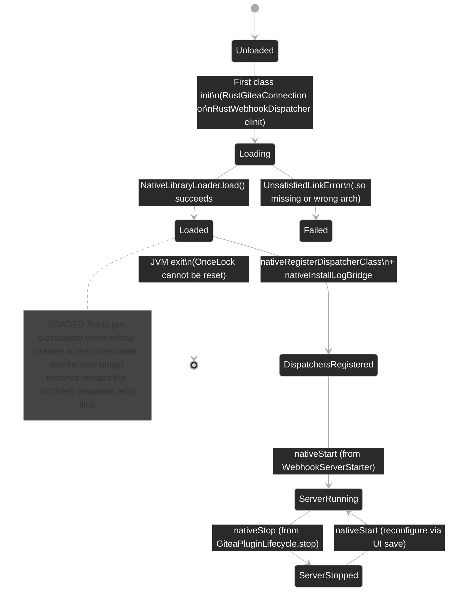

# Architecture Reference

This document is the **canonical reference** for the internal architecture of the Rust-accelerated Gitea plugin. It covers component boundaries, request flows, header processing, hook dispatch, and lifecycle hooks.

For installation/ops see [`PRODUCTION.md`](./PRODUCTION.md). For migration see [`MIGRATION.md`](./MIGRATION.md). For agent-facing operating manual see [`../AGENTS.md`](../AGENTS.md).

---

## 1. C4 Context — system overview

Who talks to what, at the highest level.



**Key insight:** the plugin has two independent network endpoints on the Jenkins controller:
- `:8080` — Jenkins UI + Stapler HTTP (existing)
- `:8081` — Rust webhook receiver (new, controlled by this plugin)

Both endpoints make outbound HTTPS calls to the Gitea REST API.

---

## 2. C4 Container — processes and binaries

```mermaid
%%{init: {'theme':'base', 'themeVariables': {'primaryTextColor':'#fff', 'primaryBorderColor':'#ccc', 'lineColor':'#aaa', 'background':'#1e1e1e', 'mainBkg':'#2a2a2a', 'secondBkg':'#3a3a3a', 'tertiaryBkg':'#444', 'edgeLabelBackground':'#2a2a2a', 'clusterBkg':'#2a2a2a', 'clusterBorder':'#888', 'actorBkg':'#2a4a6a', 'actorBorder':'#6af', 'actorTextColor':'#fff', 'actorLineColor':'#888', 'signalColor':'#fff', 'signalTextColor':'#fff', 'labelBoxBkgColor':'#2a2a2a', 'labelTextColor':'#fff', 'loopTextColor':'#fff', 'noteBorderColor':'#888', 'noteBkgColor':'#444', 'activationBorderColor':'#888', 'activationBkgColor':'#444', 'sequenceNumberColor':'#fff'}}}%%
graph TB
    subgraph JVM["Jenkins controller JVM (JDK 21)"]
        direction TB
        JenkinsCore["Jenkins core<br/>(Jetty + Stapler)"]
        Plugin["gitea.hpi<br/>(this plugin)"]
        OtherPlugins["Other plugins<br/>(workflow-multibranch,<br/>branch-api, git, ...)"]
    end

    subgraph Native["libgitea_rust.so (~5 MB, multi-arch)"]
        direction TB
        TokioRT["tokio Runtime<br/>(1 per process, multi-thread)"]
        AxumServer["axum HTTP server (:8081)"]
        ReqwestPool["reqwest Client pool<br/>(max 32, TTL 5 min)"]
        RustlsStore["rustls trust store<br/>(webpki-roots + custom PEM)"]
        PromRegistry["prometheus registry"]
    end

    Plugin -.loads via System.load.-> Native
    Plugin -->|"JNI: 41 native methods"| Native
    Native -->|"JNI callback:<br/>GlobalRef to RustWebhookDispatcher"| Plugin

    JenkinsCore --> Plugin
    JenkinsCore --> OtherPlugins
    OtherPlugins -.uses GiteaConnection SPI.-> Plugin

    TokioRT --> AxumServer
    TokioRT --> ReqwestPool
    ReqwestPool --> RustlsStore

    classDef jvm fill:#1f6f1f,stroke:#5f5,color:#fff
    classDef native fill:#7a5a00,stroke:#fc5,color:#fff
    class Plugin,JenkinsCore,OtherPlugins jvm
    class TokioRT,AxumServer,ReqwestPool,RustlsStore,PromRegistry native
```

### Container responsibilities

| Container | Owns | Doesn't own |
|---|---|---|
| **JVM** | Jenkins lifecycle, plugin loading, Jackson `ObjectMapper`, SCMEvent bus, Multibranch Pipeline orchestration | Network I/O on :8081, HTTP client connection pool, HMAC computation |
| **libgitea_rust.so** | axum HTTP server (:8081), tokio runtime, reqwest connection pool, TLS trust material, HMAC, rate limiter, idempotency cache, Prometheus counters | POJO types, Jackson, Jenkins extension points, Stapler |

---

## 3. C4 Component — inside the plugin

```mermaid
%%{init: {'theme':'base', 'themeVariables': {'primaryTextColor':'#fff', 'primaryBorderColor':'#ccc', 'lineColor':'#aaa', 'background':'#1e1e1e', 'mainBkg':'#2a2a2a', 'secondBkg':'#3a3a3a', 'tertiaryBkg':'#444', 'edgeLabelBackground':'#2a2a2a', 'clusterBkg':'#2a2a2a', 'clusterBorder':'#888', 'actorBkg':'#2a4a6a', 'actorBorder':'#6af', 'actorTextColor':'#fff', 'actorLineColor':'#888', 'signalColor':'#fff', 'signalTextColor':'#fff', 'labelBoxBkgColor':'#2a2a2a', 'labelTextColor':'#fff', 'loopTextColor':'#fff', 'noteBorderColor':'#888', 'noteBkgColor':'#444', 'activationBorderColor':'#888', 'activationBkgColor':'#444', 'sequenceNumberColor':'#fff'}}}%%
graph LR
    subgraph JavaPlugin["Java side (gitea.hpi)"]
        direction TB
        SPI["META-INF/services/<br/>GiteaConnectionFactory<br/>(1 line: RustGiteaConnectionFactory)"]
        RustGiteaConnectionFactory["RustGiteaConnectionFactory"]
        RustGiteaConnection["RustGiteaConnection<br/>(38 native methods)"]
        RustWebhookDispatcher["RustWebhookDispatcher<br/>(JNI callback target)"]
        WebhookServerStarter["WebhookServerStarter<br/>(Plugin @Initializer)"]
        GiteaPluginLifecycle["GiteaPluginLifecycle<br/>(Plugin.stop → nativeStop)"]
        RustLogReceiver["RustLogReceiver<br/>(tracing → JUL bridge)"]
        NativeLibraryLoader["NativeLibraryLoader<br/>(.so extraction)"]
        GiteaServersConfig["GiteaServers<br/>(global config + UI)"]
        Untouched["~95 upstream classes<br/>(SCM, traits, events, POJOs, Jelly)"]
    end

    subgraph RustCore["Rust side (libgitea_rust.so)"]
        direction TB
        JniExports["jni.rs (35 exports)<br/>+ jni_webhook.rs (3)<br/>+ jni_polling.rs (2)<br/>+ jni_log.rs (1)"]
        Server["server.rs<br/>(axum router + handlers)"]
        Client["client.rs<br/>(GiteaClient async)"]
        Pool["pool.rs<br/>(connection pool)"]
        RateLimiter["rate_limiter.rs"]
        Tls["tls.rs / tls_store.rs"]
        Proxy["proxy.rs"]
        Polling["polling.rs"]
        LogBridge["log_bridge.rs"]
        Events["events.rs<br/>(serde types)"]
        Auth["auth.rs<br/>(None/Token/Basic)"]
        Runtime["runtime.rs<br/>(Lazy tokio Runtime)"]
    end

    %% SPI is the entry point for upstream code
    Untouched -->|"uses"| SPI
    SPI -.->|"resolved by ServiceLoader"| RustGiteaConnectionFactory
    RustGiteaConnectionFactory --> RustGiteaConnection

    %% JNI boundary
    RustGiteaConnection -->|"38 native calls"| JniExports
    WebhookServerStarter -->|"configure()"| RustWebhookDispatcher
    RustWebhookDispatcher -->|"nativeStart/nativeStop"| JniExports
    GiteaPluginLifecycle -->|"nativeStop on Plugin.stop"| RustWebhookDispatcher
    RustLogReceiver -.receives logs via.-> LogBridge
    NativeLibraryLoader -.loads .so.-> RustCore

    %% Rust internal
    JniExports --> Server
    JniExports --> Client
    JniExports --> Polling
    Server --> RateLimiter
    Server --> Client
    Server --> Events
    Client --> Pool
    Client --> Auth
    Client --> Tls
    Client --> Proxy
    Pool --> Tls
    Pool --> Proxy
    Runtime -.drives.-> Server
    Runtime -.drives.-> Client
    Runtime -.drives.-> Polling
    LogBridge -.forwards events.-> RustWebhookDispatcher

    classDef java fill:#1f6f1f,stroke:#5f5,color:#fff
    classDef rust fill:#7a5a00,stroke:#fc5,color:#fff
    classDef upstream fill:#3a3a3a,stroke:#888,stroke-dasharray: 5 5,color:#fff
    class RustGiteaConnectionFactory,RustGiteaConnection,RustWebhookDispatcher,WebhookServerStarter,GiteaPluginLifecycle,RustLogReceiver,NativeLibraryLoader,GiteaServersConfig,SPI java
    class JniExports,Server,Client,Pool,RateLimiter,Tls,Proxy,Polling,LogBridge,Events,Auth,Runtime rust
    class Untouched upstream
```

### Component responsibility matrix

| Java component | Lines | Responsibility | Native counterpart |
|---|---|---|---|
| `RustGiteaConnectionFactory` | 30 | SPI implementation, returns `RustGiteaConnection` | — |
| `RustGiteaConnection` | ~700 | 38 native method declarations, Jackson parse helpers | `jni.rs` (35 exports) |
| `RustWebhookDispatcher` | ~400 | JNI callback target, SCMEvent dispatch, server lifecycle | `jni_webhook.rs` (3 exports) |
| `WebhookServerStarter` | ~100 | `@Initializer` boot hook | — |
| `GiteaPluginLifecycle` | ~120 | `Plugin.stop()` → `nativeStop()` + JVM shutdown hook | — |
| `RustLogReceiver` | ~100 | `handleLog(level, target, msg)` → JUL | `log_bridge.rs` |
| `NativeLibraryLoader` | ~130 | Cross-platform `.so` extraction + double-load protection | — |
| `GiteaServers` | ~900 | Global config: 12 fields, UI binding, JSON builders | — |

---

## 4. Sequence diagrams

### 4.1 Outbound — Jenkins fetches data from Gitea API

```mermaid
%%{init: {'theme':'base', 'themeVariables': {'primaryTextColor':'#fff', 'primaryBorderColor':'#ccc', 'lineColor':'#aaa', 'background':'#1e1e1e', 'mainBkg':'#2a2a2a', 'secondBkg':'#3a3a3a', 'tertiaryBkg':'#444', 'edgeLabelBackground':'#2a2a2a', 'clusterBkg':'#2a2a2a', 'clusterBorder':'#888', 'actorBkg':'#2a4a6a', 'actorBorder':'#6af', 'actorTextColor':'#fff', 'actorLineColor':'#888', 'signalColor':'#fff', 'signalTextColor':'#fff', 'labelBoxBkgColor':'#2a2a2a', 'labelTextColor':'#fff', 'loopTextColor':'#fff', 'noteBorderColor':'#888', 'noteBkgColor':'#444', 'activationBorderColor':'#888', 'activationBkgColor':'#444', 'sequenceNumberColor':'#fff'}}}%%
sequenceDiagram
    autonumber
    participant Job as Jenkins Job<br/>(Multibranch Pipeline)
    participant SCM as GiteaSCMSource
    participant Conn as GiteaConnection
    participant Rust as RustGiteaConnection<br/>(Java shim)
    participant JNI as jni.rs
    participant Client as GiteaClient<br/>(Rust async)
    participant Pool as connection pool
    participant Gitea as Gitea REST API

    Job->>SCM: fetch branches for repo "acme/widget"
    SCM->>Conn: Gitea.server(url).as(token).open()
    Note over Conn: GiteaConnectionFactory SPI<br/>resolves to RustGiteaConnectionFactory
    Conn->>Rust: new RustGiteaConnection(serverUrl, auth)
    Rust->>Rust: encode auth → (authType=1, secret=token)

    SCM->>Conn: fetchBranches("acme", "widget")
    Conn->>Rust: fetchBranches("acme", "widget")
    Rust->>JNI: nativeFetchBranches(serverUrl, authType, secret, "acme", "widget")
    JNI->>JNI: RT.block_on(async {...})
    JNI->>Client: GiteaClient::with_extra_pem(None)
    Client->>Pool: acquire((base_url, auth_hash))
    Pool->>Pool: cache hit? return existing Client
    alt cache miss
        Pool->>Pool: build new reqwest::Client<br/>(rustls + proxy + timeout)
    end
    Client->>Gitea: GET /api/v1/repos/acme/widget/branches<br/>Authorization: token <T>
    Gitea-->>Client: 200 OK + JSON body<br/>Link: <...?page=2>; rel="next"

    Note over Client: pagination loop
    loop while Link header has rel="next"
        Client->>Gitea: GET /api/v1/repos/acme/widget/branches?page=2
        Gitea-->>Client: 200 OK + JSON
    end

    Note over Client: concatenate pages<br/>strip null entries<br/>return as single JSON String
    Client-->>JNI: Ok("{\"...\":[{...}]}")
    JNI-->>Rust: jstring (raw JSON)
    Rust-->>SCM: List&lt;GiteaBranch&gt;<br/>(Jackson parsed)
    SCM-->>Job: branch heads
```

**Key points:**
- **Step 5**: Auth encoding happens in Java constructor (cheap), not per-call
- **Step 11**: Connection pool keyed by `(base_url, auth_hash)` — secret is hashed, never in plaintext logs
- **Steps 17-19**: Pagination handled transparently in Rust via `Link` header parsing
- **Step 22**: JSON returned as `String` — Java side does Jackson parsing, no POJO duplication in Rust

### 4.2 Inbound — Gitea sends a webhook

```mermaid
%%{init: {'theme':'base', 'themeVariables': {'primaryTextColor':'#fff', 'primaryBorderColor':'#ccc', 'lineColor':'#aaa', 'background':'#1e1e1e', 'mainBkg':'#2a2a2a', 'secondBkg':'#3a3a3a', 'tertiaryBkg':'#444', 'edgeLabelBackground':'#2a2a2a', 'clusterBkg':'#2a2a2a', 'clusterBorder':'#888', 'actorBkg':'#2a4a6a', 'actorBorder':'#6af', 'actorTextColor':'#fff', 'actorLineColor':'#888', 'signalColor':'#fff', 'signalTextColor':'#fff', 'labelBoxBkgColor':'#2a2a2a', 'labelTextColor':'#fff', 'loopTextColor':'#fff', 'noteBorderColor':'#888', 'noteBkgColor':'#444', 'activationBorderColor':'#888', 'activationBkgColor':'#444', 'sequenceNumberColor':'#fff'}}}%%
sequenceDiagram
    autonumber
    participant Gitea as Gitea server
    participant Axum as axum :8081<br/>(server.rs)
    participant RL as Rate limiter
    participant CIDR as IP allowlist
    participant HMAC as HMAC verifier
    participant Dedup as X-Gitea-Delivery<br/>LRU cache
    participant JNIcb as JNI callback<br/>(jni_webhook.rs)
    participant Disp as RustWebhookDispatcher<br/>(Java)
    participant SCM as Jenkins SCMEvent bus
    participant Job as Multibranch Pipeline

    Gitea->>Axum: POST /gitea-webhook/post<br/>X-Gitea-Event: push<br/>X-Gitea-Signature: &lt;hex&gt;<br/>X-Gitea-Delivery: &lt;uuid&gt;<br/>Authorization: Bearer &lt;tok&gt;<br/>Body: {"ref":"...","repository":{...}}

    Note over Axum: axum handler runs on<br/>tokio worker thread

    Axum->>CIDR: extract ConnectInfo(SocketAddr)<br/>check client IP against allowed CIDRs
    alt IP not allowed
        CIDR-->>Axum: 403 Forbidden
        Axum-->>Gitea: 403
    end

    Axum->>RL: bucket.get_or_create(ip).try_consume(1)
    alt rate exhausted
        RL-->>Axum: 429 Too Many Requests
        Axum-->>Gitea: 429
    end

    Axum->>HMAC: compute HMAC-SHA256(body, secret)<br/>compare with X-Gitea-Signature
    alt bearer configured + token mismatch
        HMAC-->>Axum: 401 Unauthorized
        Axum-->>Gitea: 401
    else HMAC mismatch
        HMAC-->>Axum: 401
        Axum-->>Gitea: 401
    end

    Axum->>Dedup: cache.contains(X-Gitea-Delivery)?
    alt duplicate
        Dedup-->>Axum: 200 OK (silent skip)
        Axum-->>Gitea: 200
        Note over Gitea: Gitea sees success<br/>no duplicate dispatch
    end

    Axum->>JNIcb: invoke_callback(event_type, payload)
    JNIcb->>JNIcb: env = jvm.attach_current_thread()
    JNIcb->>JNIcb: class = DISPATCHER_CLASS (GlobalRef)
    JNIcb->>Disp: env.call_static_method(<br/>class, "handleEvent", "(String,String)V",<br/>[type, payload])

    Disp->>Disp: MAPPER.readValue(payload, GiteaPushEvent.class)
    Disp->>Disp: new GiteaPushSCMEvent(event)
    Disp->>SCM: SCMHeadEvent.fireNow(scmEvent)

    SCM-->>Job: source.onSCMHeadEvent(event)
    Job->>Job: trigger build scan

    Disp-->>JNIcb: void return
    JNIcb-->>Axum: Ok(())
    Axum-->>Gitea: 200 OK

    Note over Axum,Prom: counters increment:<br/>gitea_webhook_requests_total{event_type="push",status="ok"}<br/>gitea_webhook_callback_latency_seconds{event_type="push"}.observe(elapsed)
```

**Header processing pipeline (in order):**

| Step | Header / source | Action | Failure → status |
|---|---|---|---|
| 1 | `ConnectInfo(SocketAddr)` from axum | Check IP ∈ allowed CIDRs | 403 |
| 2 | — | Per-IP token bucket consume | 429 |
| 3 | `Authorization: Bearer <token>` | Constant-time compare with configured bearer | 401 |
| 4 | `X-Gitea-Signature` | HMAC-SHA256 of body vs header | 401 |
| 5 | `X-Gitea-Delivery` | LRU cache lookup (idempotency) | 200 (silent) |
| 6 | `X-Gitea-Event` | Route to handler (push/pull_request/create/delete/release/repository) | 400 if missing |
| 7 | Body | Pass raw JSON to Java callback | — |

**Header replacement / mutation:** the plugin **does not** mutate any inbound headers. The pipeline is read-only — we either accept or reject. This is intentional: mutating headers between Gitea and Jenkins would create audit ambiguity.

### 4.3 Plugin load + auto-start sequence

```mermaid
%%{init: {'theme':'base', 'themeVariables': {'primaryTextColor':'#fff', 'primaryBorderColor':'#ccc', 'lineColor':'#aaa', 'background':'#1e1e1e', 'mainBkg':'#2a2a2a', 'secondBkg':'#3a3a3a', 'tertiaryBkg':'#444', 'edgeLabelBackground':'#2a2a2a', 'clusterBkg':'#2a2a2a', 'clusterBorder':'#888', 'actorBkg':'#2a4a6a', 'actorBorder':'#6af', 'actorTextColor':'#fff', 'actorLineColor':'#888', 'signalColor':'#fff', 'signalTextColor':'#fff', 'labelBoxBkgColor':'#2a2a2a', 'labelTextColor':'#fff', 'loopTextColor':'#fff', 'noteBorderColor':'#888', 'noteBkgColor':'#444', 'activationBorderColor':'#888', 'activationBkgColor':'#444', 'sequenceNumberColor':'#fff'}}}%%
sequenceDiagram
    autonumber
    participant Jenkins as Jenkins core
    participant Plugin as GiteaPluginLifecycle<br/>(Plugin class)
    participant RWD as RustWebhookDispatcher
    participant NLL as NativeLibraryLoader
    participant Lib as libgitea_rust.so
    participant Starter as WebhookServerStarter<br/>(@Initializer)
    participant Servers as GiteaServers<br/>(global config)

    Jenkins->>Plugin: instantiate (via MANIFEST Plugin-Class)
    Plugin->>Plugin: start()<br/>Runtime.addShutdownHook(this::nativeStop)

    Note over Jenkins: ... EXTENSIONS_AUGMENTED milestone ...

    Jenkins->>Starter: @Initializer fires<br/>(after EXTENSIONS_AUGMENTED,<br/>before JOB_LOADED)
    Starter->>Servers: GiteaServers.get()<br/>(load config.xml)
    Servers-->>Starter: webhookPort=8081,<br/>webhookSecret=...,<br/>webhookPath=/gitea-webhook,...

    Note over RWD: First reference to RustWebhookDispatcher<br/>triggers &lt;clinit&gt;
    Jenkins->>RWD: class load
    RWD->>NLL: load("gitea_rust")
    NLL->>NLL: detect os + arch<br/>scan /META-INF/native/&lt;os&gt;/&lt;arch&gt;/
    NLL->>NLL: extract .so to temp file<br/>LOADED.add("gitea_rust")
    NLL->>Lib: System.load(temp_path)
    Lib-->>NLL: ok

    RWD->>Lib: nativeRegisterDispatcherClass(RustWebhookDispatcher.class)
    Lib->>Lib: OnceLock::set(GlobalRef)
    RWD->>Lib: nativeInstallLogBridge()
    Lib->>Lib: tracing_subscriber::set_global_default(LogBridgeLayer)

    Starter->>RWD: configure(8081, secret, bearer, cidrs, 60, "/gitea-webhook")
    RWD->>Lib: nativeStart(8081, secret, bearer, cidrs, 60, "/gitea-webhook")
    Lib->>Lib: RT.spawn(WebhookServer::start(...))
    Lib-->>RWD: ok
    RWD->>RWD: running=true, currentPort=8081, currentPath=...
    RWD-->>Starter: void
    Starter-->>Jenkins: boot continues

    Note over Lib: axum listens on :8081<br/>ready for webhooks
```

### 4.4 Hot-reload (Plugin.stop) sequence



**Before v1.3.0:** `nativeStop()` was only called from `RustWebhookDispatcher.configure()` during reconfigure. Plugin unload left tokio threads alive → "Address already in use" on next reload.

**After v1.3.0:** `GiteaPluginLifecycle.stop()` calls `nativeStop()` explicitly. Belt-and-suspenders: a JVM shutdown hook also exists for SIGKILL/SIGTERM cases that bypass `Plugin.stop()`.

---

## 5. Hook event type → SCMEvent mapping

Each webhook `X-Gitea-Event` header value maps to a specific Java-side event class and Jenkins SCMEvent bus call:



**Why `repository` fires `SCMSourceEvent` (not `SCMHeadEvent`):** repository events affect the source (e.g. archived flag, transfer), not individual branches/PRs. The other 5 types affect heads (branch updates, PR opens/closes, tag creates).

**Why `issues` is ignored:** Gitea sends issue webhooks by default but they have no Jenkins-SCM semantic equivalent. We accept the webhook (200 OK) and log at FINE to avoid filling the audit log.

---

## 6. Header processing pipeline (detailed)

This is the exact order of checks the Rust axum handler runs for every `POST /gitea-webhook/post`. Reordering these changes security semantics — see comments.



### Header reference

| Header | Required? | Used by | Effect on absence/mismatch |
|---|---|---|---|
| `X-Gitea-Event` | **required** | routing | 400 Bad Request |
| `X-Gitea-Signature` | required if HMAC configured | auth | 401 Unauthorized |
| `X-Gitea-Delivery` | optional but recommended | idempotency | if missing, no dedup (event always dispatched) |
| `Authorization: Bearer <token>` | required if bearer configured | auth | 401 Unauthorized |
| `Content-Type` | ignored | — | Rust reads body as Bytes regardless |
| `User-Agent` | ignored | — | logged at DEBUG for audit |
| Source IP | always available | rate limit + CIDR | cannot be absent |

### Why the order matters

- **IP check first** — blocked IPs cannot burn rate-limit tokens or run HMAC computation. Otherwise a spoofed source could DoS the rate limiter.
- **Rate limit before bearer/HMAC** — even valid clients are rate-limited; otherwise a misconfigured Gitea retry loop could starve other clients.
- **Bearer before HMAC** — bearer is O(1) string compare, HMAC is O(body_size) cryptographic operation. Cheap check first.
- **HMAC before dedup** — dedup is for **legitimate** retries from authenticated Gitea, not for hiding spoofed replays from an attacker.
- **Dedup before parse** — once we know it's a duplicate, no need to spend CPU on JSON parsing.
- **Parse last** — only after all security checks pass do we touch serde/Jackson.

---

## 7. Configuration fields — what each one does

The `GiteaServers` global config (UI: `Manage Jenkins → System → Gitea Servers`) exposes 12 webhook + TLS + proxy fields. Here's the full reference:

| Field | Default | Where it's used | Security note |
|---|---|---|---|
| `webhookPort` | `8081` | `nativeStart` arg 1 | Bind to `0.0.0.0:port` — must be reachable from Gitea |
| `webhookSecret` | `""` (disabled) | `nativeStart` arg 2 (HMAC-SHA256 key) | Plaintext in config.xml — encrypt filesystem at rest |
| `webhookBearerToken` | `""` (disabled) | `nativeStart` arg 3 | Defence-in-depth on top of HMAC |
| `webhookAllowedCidrs` | `""` (allow all) | `nativeStart` arg 4 (comma-separated CIDRs) | Strongly recommended to set to Gitea server IP range |
| `webhookRateLimitPerMinute` | `60` | `nativeStart` arg 5 (token bucket capacity) | Sustained = value/60 req/s, burst up to value |
| `webhookPath` | `/gitea-webhook` | `nativeStart` arg 6 (route prefix) | Change if reverse proxy needs custom path |
| `webhookExternalUrl` | `""` (use synthesized) | `GiteaWebhookListener.buildHookUrl()` | Override for reverse proxy / NAT |
| `trustedCertificatesPem` | `""` (Mozilla CA only) | `nativeSetTrustedCertificates` | PEM with corp CA for self-signed Gitea |
| `proxyUrl` | `""` | `nativeSetProxy` → `proxy.rs` | http/https/socks5/socks5h URL |
| `proxyUsername` | `""` | same | Basic auth to proxy |
| `proxyPassword` | `""` | same | Plaintext in config.xml |
| `noProxyHosts` | `""` | same (comma-separated) | Skip proxy for these hosts |
| `pollingIntervalSeconds` | `0` (disabled) | `nativeStartPolling` | Fallback if webhooks fail |

---

## 8. Native library lifecycle



---

## 9. Observability — where each event surfaces

| Signal | Where it shows up | Configured via |
|---|---|---|
| `tracing::info!/warn!/error!` in Rust | Jenkins System Log (logger `org.jenkinsci.plugin.gitea.*`) | `RustLogReceiver` + `log_bridge.rs` |
| `tracing::debug!/trace!` | dropped at the layer | filtered to avoid noise |
| `java.util.logging` in Java | same logger namespace | Jenkins System Log UI |
| `gitea_webhook_requests_total` | Prometheus scrape `GET :8081/metrics` | `prometheus` crate |
| `gitea_webhook_callback_latency_seconds` | same | histogram buckets `[0.001...1.0]` |
| `/health` endpoint | `GET :8081/health` → 200 | Kubernetes liveness probe |
| Plugin load error | `org.jenkinsci.plugin.gitea.webhook.RustWebhookDispatcher` SEVERE | startup log |
| `UnsatisfiedLinkError` | plugin manager + startup log | plugin load |

---

## 10. Compatibility surface

The plugin is **API-compatible** with upstream `jenkinsci/gitea-plugin @ ae31972`:

| Layer | Compatibility | Notes |
|---|---|---|
| `GiteaConnection` interface | 100% | All 35 methods preserved, signature-identical |
| `GiteaConnectionFactory` SPI | 100% | ServiceLoader file swapped: `Default` → `Rust` |
| 41 POJO types (`client/api/*.java`) | 100% | Untouched, Jackson annotations intact |
| 13 traits (BranchDiscovery, ForkPR, etc.) | 100% | Untouched |
| 16 Jelly UI templates | 100% | Untouched (we add new fields to GiteaServers only) |
| `GiteaSCMSource` / `GiteaSCMNavigator` | 100% | Untouched |
| Webhook event POJOs | 100% | Untouched |
| `config.xml` schema | **additive** | New fields added; old fields still parse |

The fork is a **drop-in replacement** at the user level. Only the implementation behind `GiteaConnectionFactory` changes.

---

## 11. What's NOT in scope (v1.x)

For transparency — these features are intentionally absent:

- **mTLS client cert outbound** (Jenkins → Gitea) — only server cert verification is supported. Tracked in `AGENTS.md` §14 open questions.
- **Windows Jenkins controllers** — no `.dll` bundled. Only `linux/amd64` + `linux/aarch64`.
- **Cluster mode (HA Jenkins)** — Tokio runtime + HMAC secret are per-process. Multi-controller needs shared state (Redis/DB) — not implemented.
- **Durable webhook retry queue** — relies on Gitea retry. If Gitea gives up after N attempts, the event is lost. Local queue is a future enhancement.
- **Hot-reload without restart** — `Plugin.stop()` cleans up tokio, but `OnceLock` for class refs cannot be reset. Reload still requires restart.
- **Webhook signature schemes other than HMAC-SHA256** — Gitea's default. RSA/Ed25519 not supported.
- **Issue/PR comment events** — `issues` event type is accepted but ignored (no SCM equivalent in Jenkins).

These limitations are documented in [`AGENTS.md` §14](../AGENTS.md#14-open-architectural-questions-todo-for-future-agents) and tracked as future work.
